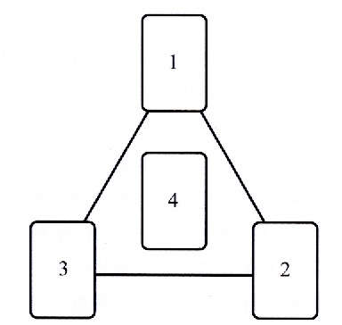
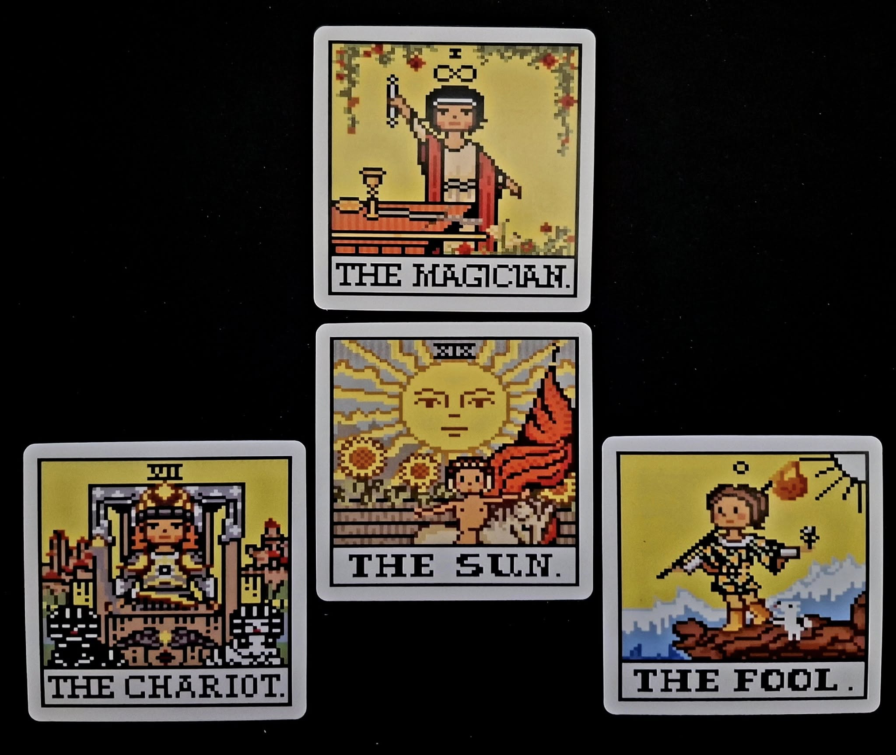

# 🐘　Ganesha IT Project Talisman Ritual (English Protocol)

This repository documents a structured magical ritual designed to support the successful acquisition of an AI-related IT project. The ritual is dedicated to Ganesha, Remover of Obstacles, and integrates a layered system of symbolic actions, visualized layout, and clear intention.

---

## ✨ Overview
- **Language**: English
- **Format**: Fixed form, repeatable, clear symbolic roles
- **Tools**: Ganesha statue, candles, incense, coin, specific tarot cards, mooncake (for offering)
- **Focus**: Practical manifestation through layered magical execution

---

## 📊 Ritual Layout
An invoking triangle tarot layout is used, as shown below:

**Layout Diagram:**

 

**Interpretation:**
1. **The Magician** — The practitioner and their skillset
2. **The Fool** — Entering the unknown / brave leap
3. **The Chariot** — Drive, momentum, execution
4. **The Sun** — Desired outcome / success

  
  

---

## 🏛 Ritual Process Summary
- Chant "Om Gam Ganapataye Namaha" x3
- Speak the set prayer (included in protocol)
- Intone "IAOM"
- Repeat Ganesha mantra x3 again

---

## ☕ Post-Success Offering
Upon success, offer a mooncake at the altar and log the result with a photo. This ritual may then be considered validated.

  
  

---

## 🔗 Files Included
- `ganesha_it_talisman.md` — Full ritual documentation (English)
- `invoking-layout.jpg` — Visual guide to tarot layout used
- `ganesha-1.jpg` — Ganesha picture
- `ganesha-2.jpg` — Tarot Cards
- `ganesha-3.jpg` — Mooncake picture 1
- `ganesha-4.jpg` — Mooncake picture 2

---

## 🐌 License & Sharing
This protocol is part of the **Open Source Witchcraft** initiative. You are free to remix, adapt, and log your own versions. Attribution encouraged.

---

## 📚 References

This ritual layout is inspired in part by the system described in:  
**Chic and Sandra Tabatha Cicero**, *Tarot Talismans: Invoke the Angels of the Tarot* (Llewellyn Publications).  
More information: [Amazon.com]([[https://www.llewellyn.com/product.php?ean=978073870058](https://www.amazon.com/Tarot-Talismans-Invoke-Angels/dp/0738708712](https://www.amazon.com/Tarot-Talismans-Invoke-Angels/dp/0738708712)

---

**Created by:** *Le Sorcier Inconnu* (The Unknown Sorcerer)  
**Location:** Ganesha Temple, Ravensgate

"May clarity meet action. May symbols become pathways."

---

© 2025 *Le Sorcier Inconnu* (The Unknown Sorcerer)  
This document is published under the terms of the **Creative Commons Attribution-ShareAlike 4.0 International License (CC BY-SA 4.0).**
